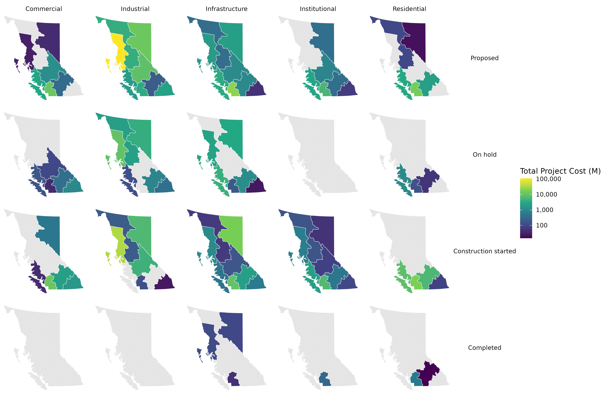

```{r global, include=FALSE}
# Copyright 2022 Province of British Columbia
#
# Licensed under the Apache License, Version 2.0 (the "License");
# you may not use this file except in compliance with the License.
# You may obtain a copy of the License at
#
# http://www.apache.org/licenses/LICENSE-2.0
#
# Unless required by applicable law or agreed to in writing, software distributed under the License is distributed on an "AS IS" BASIS,
# WITHOUT WARRANTIES OR CONDITIONS OF ANY KIND, either express or implied.
# See the License for the specific language governing permissions and limitations under the License.

#libraries----------
library(tidyverse)
library(shinyWidgets)
library(googlesheets4)
#load objects----------
short <- readRDS(here::here("processed_data", "mpi_shortraw.rds"))
by_region_tables <- readRDS(here::here("processed_data","by_region_tables.rds"))
all_regions_tables <- readRDS(here::here("processed_data","all_regions_tables.rds"))
by_region_plots <- readRDS(here::here("processed_data","by_region_plots.rds"))
all_regions_plots <- readRDS(here::here("processed_data","all_regions_plots.rds"))
long_aggregated <- readRDS(here::here("processed_data","long_aggregated.rds"))
#functions------------
#Extractor function (retrieve cell) for all_regions_* dataframes---------- 
extract_all_regions_cell <- function(df, name){
  df <- df%>%
    filter(thing_name==name)%>%
    select(value)%>%
    pull()
  df<- df[[1]] 
  if(is.data.frame(df)){
    colnames(df) <- colnames(df)%>%
    str_replace_all("_"," ")%>%
    str_to_title()
  }
  return(df)
}
#Extractor function (retrieve cell) for by_region_* dataframes------------- 
datatable_cell <- function(df, type, reg){
  df <- df%>%
    filter(region==reg)%>%
    select(all_of(type))%>%
    pull()
  df<- df[[1]]
  if(is.data.frame(df)){
    colnames(df) <- colnames(df)%>%
    str_replace_all("_"," ")%>%
    str_to_title()
  }
  return(df)
}
```

# Regional Map

## Inputs {.sidebar}

<br>

-   This dashboard contains two Maps and Provincial and Regional analyses of Major Projects.
-   You can navigate to these sections by clicking on the header bar.
-   The data used in the Provincial and Regional analyses can be downloaded from the table tab.
-   All data retrieved from [British Columbia's Major Project Inventory](https://www2.gov.bc.ca/gov/content/employment-business/economic-development/industry/bc-major-projects-inventory/recent-reports).
<br>

### User survey:

```{r}

textInput(
  "who",
  "Tell us a bit about yourself: e.g. who do you work for?")

textInput(
  "what",
  "What do you use the MPI for?")
textInput(
  "features", 
  "What additional features would you like to see?")
 actionButton("submit", "Submit")

textB <- reactive({
  as.data.frame(c(input$who, input$what, input$features))
})
  
observeEvent(input$submit, {
    Selfie <-   gs4_get('https://docs.google.com/spreadsheets/d/1ZK7PmApXRzVgmeSY6i3Hf7rWLUsvJjVbgyJ4LAS0ECc/edit?usp=sharing')
    sheet_append(Selfie, data = textB())
    showNotification("Thanks for your feedback.")
})
```

## Column

### MPI by region in `r max(all_regions_tables[[2]][[2]]$quarter)`:

```{r}
wrapR::bc_reg_choro(long_aggregated, region, name, value, "comma")
```


# By type and stage

## Column

### MPI by region type and stage in `r max(all_regions_tables[[2]][[2]]$quarter)`:



# Provincial Analysis

## Inputs {.sidebar}

<br>

```{r}
selectInput("name", label = "Choose a slice of data:",
            choices = all_regions_tables$thing_name, selected = all_regions_tables$thing_name[1])
```

## Column {.tabset}

### Plot:

```{r}
plotly::renderPlotly({
  extract_all_regions_cell(all_regions_plots, input$name)
})%>%
  bindCache(input$name)
```

### Table:

```{r}
DT::renderDataTable(server=FALSE,{
  extract_all_regions_cell(all_regions_tables, input$name)%>%
    DT::datatable(extensions = "Buttons", 
              options = list(rownames = FALSE, 
                             columnDefs = list(list(className = 'dt-center', targets = "_all")),
                             paging = TRUE,
                             scrollX=TRUE,
                             scrollY=TRUE,
                             searching = TRUE,
                             ordering = TRUE,
                             dom = 'Btip',
                             buttons = list(
                                list(extend = 'csv', filename =  paste("MPI-BC", input$name, sep = "-")),
                                list(extend = 'excel', filename =  paste("MPI-BC", input$name, sep = "-"))
                             ),
                             pageLength=10, 
                             lengthMenu=c(3,5)))
})%>%
  bindCache(input$name)
```

# Regional Analysis

## Inputs {.sidebar}

<br>

```{r}
selectInput("region", label = "Which Region:",
            choices = by_region_tables$region, selected = by_region_tables$region[1])

selectInput("table", label = "Which Data:",
            choices = sort(colnames(by_region_tables)[-1]), selected = sort(colnames(by_region_tables)[-1])[1])
```

## Column {.tabset}

### Plot:

```{r}
plotly::renderPlotly({
  datatable_cell(by_region_plots, input$table, input$region)
})%>%
  bindCache(input$table, input$region)
```

### Table:

```{r}
DT::renderDataTable(server=FALSE,{
  datatable_cell(by_region_tables, input$table, input$region)%>%
    DT::datatable(extensions = "Buttons", 
              options = list(rownames = FALSE, 
                             columnDefs = list(list(className = 'dt-center', targets = "_all")),
                             paging = TRUE,
                             scrollX=TRUE,
                             scrollY=TRUE,
                             searching = TRUE,
                             ordering = TRUE,
                             dom = 'Btip',
                             buttons = list(
                                list(extend = 'csv', filename =  paste("MPI", input$region, input$table, sep = "-")),
                                list(extend = 'excel', filename =  paste("MPI", input$region, input$table, sep = "-"))
                             ),
                             pageLength=10, 
                             lengthMenu=c(3,5)))
})%>%
  bindCache(input$table, input$region)
```

