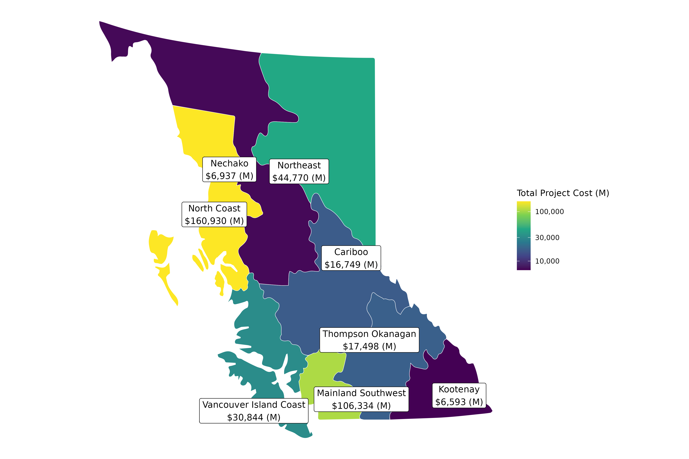

```{r global, include=FALSE}
# Copyright 2022 Province of British Columbia
#
# Licensed under the Apache License, Version 2.0 (the "License");
# you may not use this file except in compliance with the License.
# You may obtain a copy of the License at
#
# http://www.apache.org/licenses/LICENSE-2.0
#
# Unless required by applicable law or agreed to in writing, software distributed under the License is distributed on an "AS IS" BASIS,
# WITHOUT WARRANTIES OR CONDITIONS OF ANY KIND, either express or implied.
# See the License for the specific language governing permissions and limitations under the License.

#libraries----------
library(tidyverse)
library(shinyWidgets)
#load objects----------
short <- readRDS(here::here("processed_data", "mpi_shortraw.rds"))
by_region_tables <- readRDS(here::here("processed_data","by_region_tables.rds"))
all_regions_tables <- readRDS(here::here("processed_data","all_regions_tables.rds"))
by_region_plots <- readRDS(here::here("processed_data","by_region_plots.rds"))
all_regions_plots <- readRDS(here::here("processed_data","all_regions_plots.rds"))
all_regions_commentary <- readRDS(here::here("processed_data","all_regions_commentary.rds"))
by_region_commentary <- readRDS(here::here("processed_data","by_region_commentary.rds"))
#functions------------
#Extractor function (retrieve cell) for all_regions_* dataframes---------- 
extract_all_regions_cell <- function(df, name){
  df <- df%>%
    filter(thing_name==name)%>%
    select(value)%>%
    pull()
  df<- df[[1]] 
  if(is.data.frame(df)){
    colnames(df) <- colnames(df)%>%
    str_replace_all("_"," ")%>%
    str_to_title()
  }
  return(df)
}
#Extractor function (retrieve cell) for by_region_* dataframes------------- 
datatable_cell <- function(df, type, reg){
  df <- df%>%
    filter(region==reg)%>%
    select(type)%>%
    pull()
  df<- df[[1]]
  if(is.data.frame(df)){
    colnames(df) <- colnames(df)%>%
    str_replace_all("_"," ")%>%
    str_to_title()
  }
  return(df)
}
```

# Regional Map

## Inputs {.sidebar}

<br>

-   This dashboard contains two Maps and Provincial and Regional analyses of Major Projects.
-   You can navigate to these sections by clicking on the header bar.
-   The data used in the Provincial and Regional analyses can be downloaded from the table tab.
-   All data retrieved from [British Columbia's Major Project Inventory](https://www2.gov.bc.ca/gov/content/employment-business/economic-development/industry/bc-major-projects-inventory/recent-reports).

## Column

### MPI by region in `r max(all_regions_tables[[2]][[2]]$quarter)`:



# By type and stage

## Inputs {.sidebar}

<br>

-   This dashboard contains two Maps and Provincial and Regional analyses of Major Projects.
-   You can navigate to these sections by clicking on the header bar.
-   The data used in the Provincial and Regional analyses can be downloaded from the table tab.
-   All data retrieved from [British Columbia's Major Project Inventory](https://www2.gov.bc.ca/gov/content/employment-business/economic-development/industry/bc-major-projects-inventory/recent-reports).

## Column

### MPI by region type and stage in `r max(all_regions_tables[[2]][[2]]$quarter)`:


# Provincial Analysis

## Inputs {.sidebar}

<br>

```{r}
selectInput("name", label = "Choose a slice of data:",
            choices = all_regions_tables$thing_name, selected = all_regions_tables$thing_name[1])

# renderUI({
#   HTML(extract_all_regions_cell(all_regions_commentary, input$name))
# })
```

## Column {.tabset}

### Plot:

```{r}
plotly::renderPlotly({
  extract_all_regions_cell(all_regions_plots, input$name)
})%>%
  bindCache(input$name)
```

### Table:

```{r}
DT::renderDataTable(server=FALSE,{
  extract_all_regions_cell(all_regions_tables, input$name)%>%
    DT::datatable(extensions = "Buttons", 
              options = list(rownames = FALSE, 
                             columnDefs = list(list(className = 'dt-center', targets = "_all")),
                             paging = TRUE,
                             scrollX=TRUE,
                             scrollY=TRUE,
                             searching = TRUE,
                             ordering = TRUE,
                             dom = 'Btip',
                             buttons = list(
                                list(extend = 'csv', filename =  paste("MPI-BC", input$name, sep = "-")),
                                list(extend = 'excel', filename =  paste("MPI-BC", input$name, sep = "-"))
                             ),
                             pageLength=10, 
                             lengthMenu=c(3,5)))
})%>%
  bindCache(input$name)
```

# Regional Analysis

## Inputs {.sidebar}

<br>

```{r}
selectInput("region", label = "Which Region:",
            choices = by_region_tables$region, selected = by_region_tables$region[1])

selectInput("table", label = "Which Data:",
            choices = sort(colnames(by_region_tables)[-1]), selected = sort(colnames(by_region_tables)[-1])[1])
```

```{r}
# renderUI({
#   HTML(datatable_cell(by_region_commentary, input$table, input$region))
# })
```

## Column {.tabset}

### Plot:

```{r}
plotly::renderPlotly({
  datatable_cell(by_region_plots, input$table, input$region)
})%>%
  bindCache(input$table, input$region)
```

### Table:

```{r}
DT::renderDataTable(server=FALSE,{
  datatable_cell(by_region_tables, input$table, input$region)%>%
    DT::datatable(extensions = "Buttons", 
              options = list(rownames = FALSE, 
                             columnDefs = list(list(className = 'dt-center', targets = "_all")),
                             paging = TRUE,
                             scrollX=TRUE,
                             scrollY=TRUE,
                             searching = TRUE,
                             ordering = TRUE,
                             dom = 'Btip',
                             buttons = list(
                                list(extend = 'csv', filename =  paste("MPI", input$region, input$table, sep = "-")),
                                list(extend = 'excel', filename =  paste("MPI", input$region, input$table, sep = "-"))
                             ),
                             pageLength=10, 
                             lengthMenu=c(3,5)))
})%>%
  bindCache(input$table, input$region)
```

# Find a project

## Inputs {.sidebar}

<br>

*  You can either drill down OR find a project by name.
*  Once a *single* project is displayed to the right, details available on next page.

```{r}
selectizeGroupUI(
        id = "my-filters",
        inline = FALSE,
        params = list(
          var_one = list(inputId = "region", title = "Filter Region", placeholder = 'select'),
          var_two = list(inputId = "municipality", title = "Filter Municipality", placeholder = 'select'),
          var_three = list(inputId = "project_type", title = "Filter Project Type", placeholder = 'select'),
          var_four = list(inputId = "project_category_name", title = "Filter Project Category", placeholder = 'select'),
          var_five = list(inputId = "public_funding_ind", title = "Filter Public Funding", placeholder = 'select'),
          var_six = list(inputId = "project_name", title = "Filter Project Name", placeholder = 'select')
        )
      )

res_mod <- callModule(
      module = selectizeGroupServer,
      id = "my-filters",
      data = short,
      vars = c("region", "municipality", "project_type","project_category_name", "public_funding_ind","project_name")
    )
# function render() needs to be defined after res_mod() otherwise R thinks res_mod() is a (missing) function not a Module.---------
render <- function(var){
  shiny::renderUI({
    if(length(unique(res_mod()$project_name))==1){
    res_mod()%>%
      pull({{  var  }})%>%
      last()
    }
  })
} 
```

## Column

```{r}
renderTable({
  df <- res_mod()%>%
    distinct(project_id, project_name, estimated_cost, region, municipality, project_type, project_category_name, public_funding_ind)%>%
    select(project_name, estimated_cost, region, municipality, project_type, project_category_name, public_funding_ind, project_id)%>%
    arrange(desc(estimated_cost))
  df <- df%>%
    mutate(project_id=as.character(project_id),
           estimated_cost=scales::dollar(estimated_cost, accuracy = 1, suffix = "(M)")
           )
  colnames(df) <- stringr::str_to_title(stringr::str_replace_all(colnames(df),"_"," "))
  df
  }) 
```


# Project Details

## Inputs {.sidebar}

<br>

*  Choose a *single* project on the Find a project page.


Row {data-height=300}
-------------------------------------
    
### Description
 
```{r}
shiny::renderUI({
  if(length(unique(res_mod()$project_name))==1){
  description <- res_mod()%>%
    pull(project_description)%>%
    last()
  name <- res_mod()%>%
    pull(project_name)%>%
    last()
  HTML(paste0("<b>",name,":</b> ", description))
  }
})
```   

Row {data-height=150}
-------------------------------------
    
### Estimated Cost:

```{r}
shiny::renderUI({
  if(length(unique(res_mod()$project_name))==1){
  res_mod()%>%
    pull(estimated_cost)%>%
    last()%>%
    scales::dollar(suffix = " (M)")
  }
})
```
    
### Construction Type:

```{r}
render(construction_type)
```

### Construction Subtype:

```{r}
render(construction_subtype)
```

### Project Type:

```{r}
render(project_type)
```

### Project Category:

```{r}
render(project_category_name)
```

### Telephone:

```{r}
render(telephone)
```

### Region:

```{r}
render(region)
```


Row {data-height=150}
-------------------------------------
  
### Municipality:

```{r}
render(municipality)
```  

### Project ID:

```{r}
render(project_id)
```

### Developer:

```{r}
render(developer)
```

### Public Funding:

```{r}
render(public_funding_ind)
```

### Green Building:

```{r}
render(green_building_ind)
```

### Clean Energy:

```{r}
render(clean_energy_ind)
```

### Indigenous:

```{r}
render(indigenous_ind)
```


Row
-------------------------------------
    
### Project Status:

```{r}
renderPlot({
  if(length(unique(res_mod()$project_name))==1){
  res_mod()%>%
    ggplot(aes(last_update, project_status))+
  geom_point()+
  scale_x_date(date_labels = "%Y %b %d",name = NULL)+
  scale_y_discrete(name=NULL, drop=FALSE)  
  }
})
```


### Project Stage:

```{r}
renderPlot({
  if(length(unique(res_mod()$project_name))==1){
  res_mod()%>%
    ggplot(aes(last_update, project_stage))+
  geom_point()+
  scale_x_date(date_labels = "%Y %b %d",name = NULL)+
  scale_y_discrete(name=NULL, drop=FALSE) 
  }
})
```


